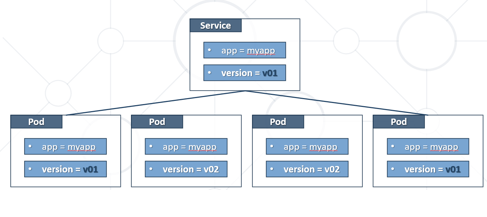
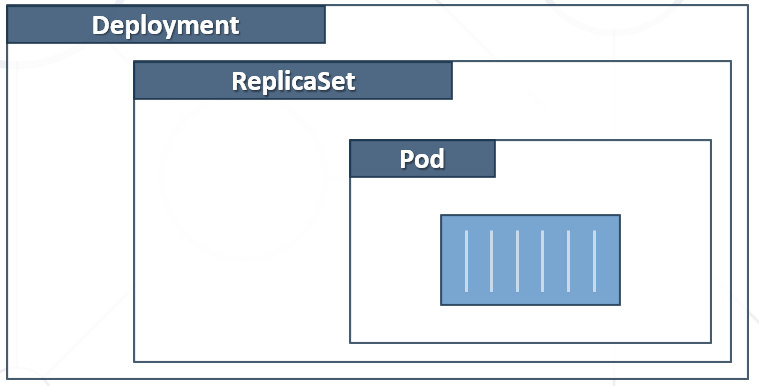

# Kubernetes Objects

- Kubernetes objects are persistent entities.
- They are used to represent the state of the cluster.
- An object is a **"record of intent"**. Once created, the Kubernetes system will constantly work to ensure that object exists.
- Almost every object includes two nested object fields.
  - **Spec** provides a description of the characteristics (**desired state**).
  - **Status** describes the current state of the object.
- They include **Pods**, **Services**, **Namespaces**, **Volumes**, etc.

## Required Fields

In the ```.yaml``` file for the Kubernetes object you want to create, you'll need to set values for the following fields:

- ```apiVersion``` - Which version of the Kubernetes API you're using to create this object
- ```kind``` - What kind of object you want to create
- ```metadata``` - Data that helps uniquely identify the object, including a name string, UID, and optional namespace
- ```spec``` - What state you desire for the object

## Kubernetes Object Management

### Imperative commands

When using imperative commands, a user operates directly on live objects in a cluster. The user provides operations to the kubectl command as arguments or flags.

Commands are invoked against live objects. We directly state what should be done. Good for development or test and for one-off tasks

Example: 

```bash
kubectl create deployment nginx --image nginx
```

### Imperative object configuration

In imperative object configuration, the **kubectl** command specifies the operation (**create**, **replace**, etc.), optional flags and **at least one file name**. The file specified must contain a full definition of the object in YAML or JSON format.

Operations are specified together with at least one file, which contains the definition of target object(s). Can be used in production.

Example:
```bash
kubectl create -f nginx.yaml
```

### Declarative object configuration

When using declarative object configuration, a user operates on object configuration files stored locally, however the user does not define the operations to be taken on the files. Create, update, and delete operations are automatically detected per-object by kubectl. This enables working on directories, where different operations might be needed for different objects.

Operates with local configuration files but the actions are not stated explicitly. Can work with files and folders.

Examples:

Process all object configuration files in the ```configs``` directory, and create or patch the live objects. You can first diff to see what changes are going to be made, and then apply:

```bash
kubectl diff -f configs/
kubectl apply -f configs/
```

Recursively process directories:

```bash
kubectl diff -R -f configs/
kubectl apply -R -f configs/
```

## Namespaces

- Kubernetes supports multiple virtual clusters.
- These virtual clusters are called **namespaces**.
- Namespaces provide a **scope for names**.
- Names of resources need to be **unique** within a namespace.
- Namespaces **cannot be nested** inside one another.
- Each Kubernetes resource can **only be in one** namespace.
- Most Kubernetes resources are in some namespace.
- Namespace resources are not themselves (and others such as **nodes**) in a namespace.
- Deleting a Namespace will clean up everything under it.

### Namespaces and DNS

When you create a Service, it creates a corresponding DNS entry. This entry is of the form ```<service-name>.<namespace-name>.svc.cluster.local```, which means that if a container only uses ```<service-name>```, it will resolve to the service which is local to a namespace. This is useful for using the same configuration across multiple namespaces such as Development, Staging and Production. If you want to reach across namespaces, you need to use the fully qualified domain name (FQDN).

### Automatic labelling (since 1.21)

The Kubernetes control plane sets an immutable label kubernetes.io/metadata.name on all namespaces. The value of the label is the namespace name.


## Pod

- Smallest **unit of scheduling**.
- **Scheduled** on nodes.
- **One** or **more** containers.
- Containers **share** the pod **environment**.
- **Deployed as one** and on **one node**. It is **atomic**.
- Created via **manifest files**.

In terms of Docker concepts, a Pod is similar to a group of Docker containers with shared namespaces and shared filesystem volumes.

Pods are generally not created directly and are created using workload resources.

```yaml
# Service information (Kubernetes Api version)
apiVersion: v1
# What kind of object you want
# Pod contains one or more containers.
kind: Pod
# Data that helps uniquely identify the object, including a name string, UID, and optional namespace
metadata:
  name: appa-pod
  # Labels are key value pairs. They can be used to target given objects
  labels:
    app: appa
    ver: v1
# What state you desire for the object
spec:
  # Specifies containers in the object (pod)
  containers:
  # Container name (first)
  - name: appa-container
    # From which image, container should be build (docker image)
    image: shekeriev/k8s-appa:v1
    ports:
    # containerPort sets the port that container will expose.
    - containerPort: 80
```


## Simple Service Manifest (YAML)

### Service Types

#### ClusterIP

exposes the Service on a **cluster-internal IP**. This way the Service will be only reachable from within the cluster. **This is the default**.

#### NodePort

exposes the Service on each Node's IP at a static port specified by the NodePort. A ClusterIP Service, to which the NodePort Service routes, is automatically created. We can contact the NodePort Service, from outside the cluster, by requesting **<NodeIP>:<NodePort>**. Default range is between **30000** and **32767**.

#### LoadBalancer

exposes the Service externally using a cloud provider's load balancer. NodePort and ClusterIP Services, to which the external load balancer routes, are automatically created.

#### ExternalName
  
maps the Service to the contents of the **externalName** field (e.g. foo.bar.example.com), by returning a **CNAME** record with its value. No proxying of any kind is set up.

  
```yaml
apiVersion: v1
# Service object expose pods to the outside world. Provide reliable network endpoint
kind: Service
metadata:
  name: appa-svc
  labels:
    app: appa
    ver: v1
spec:
  # Specifies service type.
  type: NodePort
  ports:
  # Port exposed by the service.
  - port: 80
  # Port exposed by the service but in the k8s cluster.
    nodePort: 30001
    protocol: TCP
  # Pods which have these labels and label values will be targeted (load balanced).
  selector:
    app: appa
    ver: v1
```


  
## Replication Controller Manifest (YAML)

```yaml
apiVersion: v1
# Replication Controller looks after pod or set of pods, scale up/down pods, sets Desired State.
kind: ReplicationController
metadata:
  name: appa-rc
spec:
  # Desired number of pods (Desired State)
  replicas: 3
  # Pods label selector
  selector:
    app: appa
  # "Hidden" pod definition
  template:
    metadata:
      labels:
        app: appa
        ver: v1
    spec:
      containers:
      - name: appa-container
        image: shekeriev/k8s-appa:v1
        ports:
        - containerPort: 80
```


  
## Replica Set Manifest (YAML)

Replica Set is rarely used in its own. It's commonly used with Deployment object.
  
```yaml
apiVersion: apps/v1
# Replica Set looks after pod or set of pods, scale up/down pods, sets desired state, preferred over Replication Controllers
kind: ReplicaSet
metadata:
  name: appa-rs
spec:
  # Desired number of pods (Desired State)
  replicas: 3
  # Pods label selector
  selector:
    # Replica Set label selector is more sophisticated than Replication Controller label selector
    matchLabels:
      app: appa
  # "Hidden" pod definition
  template:
    metadata:
      labels:
        app: appa
        ver: v1
    spec:
      containers:
      - name: appa-container
        image: shekeriev/k8s-appa:v1
        ports:
        - containerPort: 80
```


  
  
## Deployment Manifest (YAML)

Deployment creates ReplicaSet
  
```yaml
apiVersion: apps/v1
# Deployment simplifies updates and rollbacks, self documenting, suitable for versioning 
kind: Deployment
metadata:
  name: appa-deploy
spec:
  # Desired number of pods (Desired State)
  replicas: 10
  # Pods label selector
  selector:
    matchLabels: 
      app: appa
      ver: v1
  # optional, default 0, how many seconds 
  minReadySeconds: 15
  # the whole block can be skipped
  strategy:
    # strategy to replace old pods, defaults to RollingUpdate
    type: RollingUpdate
    rollingUpdate:
      # maximum number of unavailable pods, defaults to 25%
      maxUnavailable: 1
      # maximum number of pods that can be created in excess, defaults to 25%
      maxSurge: 1
  # "Hidden" pod definition
  template:
    metadata:
      labels:
        app: appa
        ver: v1
    spec:
      containers:
      - name: appa-container
        image: shekeriev/k8s-appa:v1
        ports:
        - containerPort: 80 
```

  
  
# Overal Architecture


